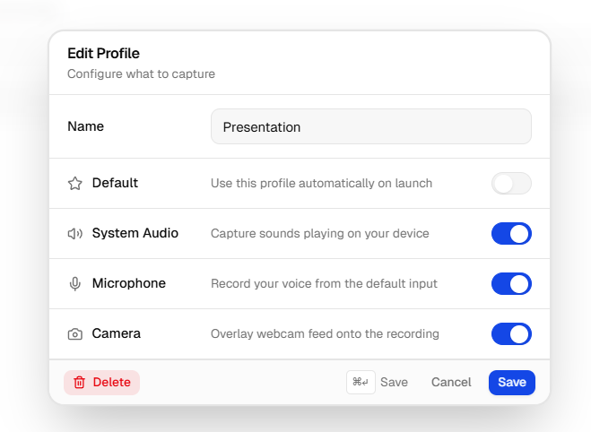

<h1 align="center">Recast</h1>

<p align="center">
  <strong>Local-first screen recording and editing.</strong> Record, polish, and share polished product demos from your own machine — your files, your storage, your sharing rules.
</p>

<p align="center">
  <a href="https://github.com/kanakkholwal/recast/actions"></a>
  <a href="https://github.com/kanakkholwal/recast/blob/main/LICENSE.md"></a>
</p>

## 📖 About

Recast is a high-performance, open-source screen recorder with cinematic
editing built in. It replaces messy timeline-based tools with a
**"Smooth by Default"** experience — aimed at founders and creators who need
polished product demos without the editing overhead.

It's a **local-first desktop app**. Recording, editing, and export all run on
your machine; nothing is uploaded by default. When you want to share, push the
finished file to **your own Google Drive** from the export dialog and copy the
Drive link — your storage account, your retention, your access controls. No
account is required to use the recorder.

**Recast Cloud** — a Loom-style hosted sharing layer with watch analytics,
per-viewer access controls, team workspaces, and custom branding — is on the
way. It's storage-agnostic by design: the free tier lets you bring your own
storage (Drive today; Cloudinary + autorender.io planned), and paid plans add
Recast-managed storage or the option to point uploads at your own S3, R2,
Azure Blob, or GCP bucket. Until Cloud lands, the free recorder + Drive flow
covers the whole loop.

## ✨ Key Features

Most of these are paid-tier features in typical SaaS recorders. In Recast they
all ship in the free local app:

- **Recording profiles** — capture presets that bundle region + window +
  camera + mic + system audio choices, with dynamic capability combinations
  and one-shortcut switching. Investor demo, changelog clip, tutorial — pick
  the profile, hit record.
- **Pause & Resume mid-take** — pause and pick up where you left off; paused
  spans are trimmed cleanly out of the final video.
- **Smart auto-zoom + cursor refinement** — Recast watches your cursor, reads
  clicks and dwell, zooms toward the moment that matters, and applies
  velocity-aware smoothing so the path never looks twitchy.
- **Silence detection** — finds dead-air segments (quiet audio + still cursor)
  and offers one-click cuts you can review or dismiss.
- **Annotations & on-frame blur** — drop arrows, rectangles, text, or a
  privacy blur straight on the frame, with layers on the timeline.
- **Camera, Mic & System Audio** — record any combination, with a floating
  webcam bubble (shape, border, follow-the-cursor) and per-source device
  picking.
- **Zero-Lag Recording** — built natively with Tauri and Rust, offloading
  high-performance video encoding (FFmpeg) to your silicon. Hardware-encoded
  exports on NVENC / AMD / Intel where available.
- **Cross-platform** — macOS, Windows, and Linux, with native screen-capture
  paths on each (including a Wayland-native pipeline on Linux and
  `ScreenCaptureKit` audio loopback on macOS).
- **Share to Your Google Drive** — opt-in OAuth flow uploads exports straight
  to your own Drive, with progress tracking and a shareable link. The video
  lives in your account, never ours.
- **You Own Your Data** — local-first by default. Recordings, edits, and
  exports stay on your machine until you choose to share them. No telemetry,
  no account required for the recorder.
- **Sleek Interface** — a "Craft" design system featuring minimal
  glassmorphism, native blurs, and Svelte 5 reactivity.

## 📸 Screenshots




## 🚀 Getting Started

### Prerequisites

- Node.js (v18+)
- [pnpm](https://pnpm.io/) (v9+)
- Rust (v1.70+) & Cargo
- [Tauri OS prerequisites](https://v2.tauri.app/start/prerequisites/) for your platform (macOS / Windows / Linux)

The one-shot setup script below can auto-install any of these that are missing.

### Installation

1. Clone the repository:

   ```sh
   git clone https://github.com/kanakkholwal/recast.git
   cd recast
   ```

2. Run the one-shot setup script. It detects your OS, auto-installs any missing
   prerequisites, downloads the FFmpeg sidecar binaries, installs workspace
   dependencies, and produces a debug build of the desktop app:

   ```sh
   # Windows (PowerShell)
   powershell -ExecutionPolicy Bypass -File scripts/setup.ps1

   # macOS / Linux
   bash scripts/setup.sh
   ```

Prefer to set things up by hand? See the
[manual setup steps in CONTRIBUTING.md](CONTRIBUTING.md#manual-setup).

### Running Locally

Start the desktop app in dev mode (spins up both the SvelteKit frontend and the
Tauri backend, with hot-reloading):

```sh
pnpm --filter recast-desktop dev
```

Or run the marketing website:

```sh
pnpm turbo run dev --filter=recast-web
```

## 🤝 Contributing

Contributions are welcome! The [Contributing Guide](CONTRIBUTING.md) covers the
codebase mental model, manual setup, building production binaries, the
changelog/release workflow, and how to submit pull requests.

## ⚖️ License

Recast is distributed under a **Dual-Licensing model**:

1. **Open Source (GPLv3)** — free for personal, educational, and open-source
   use. As a strong copyleft license, any modifications or derived works must
   also be open-sourced under the same license.
2. **Commercial License** — required for enterprise deployment, proprietary
   commercial use, and closed-source redistribution. If you want to keep your
   modifications private or sell a derived product, you must purchase a
   commercial license.

See [LICENSE.md](LICENSE.md) for full legal details.
